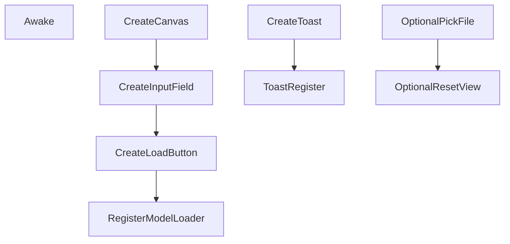

# Unity Runtime Scripts — Detailed Reference

| Script | Namespace | Responsibilities |
|--------|-----------|------------------|
| `RuntimeUIBootstrap.cs` | *global* | Creates InputField, Buttons (Load, Pick File, Reset View), Toast `Text` at runtime; registers ModelLoader & Toast. |
| `ModelLoader.cs` | `LaprascopeAR` | Downloads/loads GLTF from URL or local file, instantiates under parent, handles duplicate clean-up, shows error toast. |
| `OrbitCamera.cs` | `LaprascopeAR` | Orbit/zoom camera with mouse & multitouch; exposes `ResetView()`. |
| `ToastUI.cs` | `ToastUI` | Static helper to show temporary red-text notifications. |
| `ARPlacement.cs` | `LaprascopeAR` | Ray-casts AR planes; on first tap positions loaded model. |

---

## RuntimeUIBootstrap.cs

* Responsive anchors are hard-coded for quick prototype.

## ModelLoader.cs
* Uses **glTFast** `GltfImport`.
* Async/await **Unity Tasks** to keep UI responsive.
* `_loadedGO` parent named `GLTFModel` for easy find.

## OrbitCamera.cs
* Euler-angle accumulation `_x, _y`.
* Multitouch pinch → delta magnitude zoom.
* Limits: `yMinLimit=-80`, `yMaxLimit=80`, `minDistance=0.5`, `maxDistance=10`.

## ToastUI.cs
* `Toast.Register(Text)` once; then `Toast.Show(msg, seconds)`.
* Uses hidden `GameObject ToastRunner` + coroutine.

## ARPlacement.cs
```
if not _placed and touchEnded and raycast hits plane:
    _loadedModel = GameObject.Find("GLTFModel")
    _loadedModel.position = hitPose.position
    _placed = true
```
* Requires `ARSessionOrigin` + `ARRaycastManager`.
